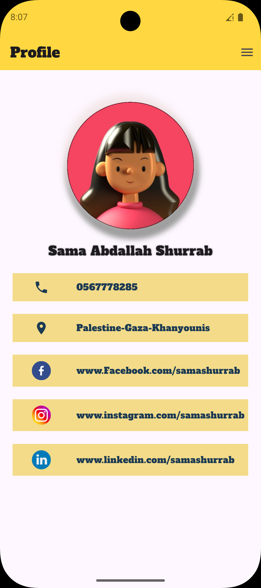

# Flutter Ui2 📱

## 📌 Project Description
A simple **Flutter** training application designed to demonstrate some of the most commonly used **UI Widgets**.  

The app includes practical examples of:  
- **Row** ➝ arrange items horizontally  
- **Column** ➝ arrange items vertically  
- **Text** ➝ display text  
- **Image** ➝ display images  
- **Icon** ➝ add icons  
- **SizedBox** ➝ create spacing or define fixed sizes
- **ElvatedButton** ➝ add button in the screen

## 📌 Project Goal
The purpose of this project is to practice and understand the usage of basic Flutter Widgets while building a simple UI as part of Task 1.

## 📌 Project Structure 📂
```plaintext
flutter-ui-task1/
 ├── lib/
 │    └── main.dart        # Main application code
 ├── assets/
 │     └── images/         # Project images
 │     └── fonts/          # Project fonts
 ├── pubspec.yaml          # Dependencies & configuration
 └── README.md             # Project documentation
```
 ## 📌 App Screenshots 📷
 Here is a preview of the app interface:




